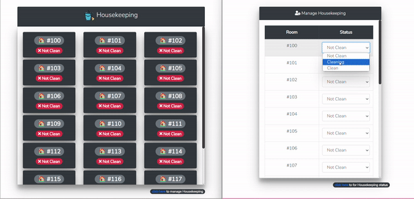

# Real Time Housekeeping

- The Real time application for monitoring & managing housekeeping task for room cleaning.
- ## Demo Link
- [Room Status](https://housekeeping-real-time.onrender.com/)
- [Manage Room Status](https://housekeeping-real-time.onrender.com/manage-rooms)

## Demo



## Package Used

[vue](https://vuejs.org/) |
[express](https://expressjs.com/) |
[socket.io](https://socket.io/) |
[Bootstrap](https://getbootstrap.com/) |
[MongoDB](https://www.mongodb.com/atlas/database) |
[Mongoose](https://www.npmjs.com/package/mongoose)

## Deployment

[Render](https://render.com/)

## Installation

- Clone this repository
- create .env file with CONNECTION_URL (refer to .example.env)
- run

```bash
npm install #install npm packages
npm run start #start the application on port 8080
```
